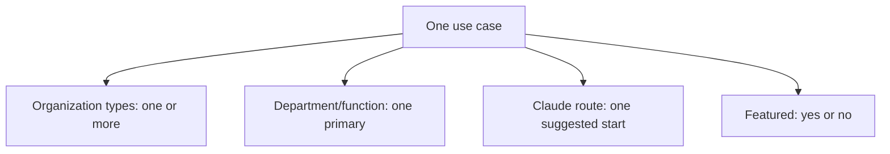

# ClaudeForGov: 57-use-case catalog and filter map

Current catalog snapshot, September 30, 2026. The source of truth for the live explorer is [`use-cases-data.js`](use-cases-data.js); the actual filtering behavior is in [`use-cases.js`](use-cases.js). This document records the current assignments, which are editorial hypotheses for exploration, not a statement of product availability, agency authorization, or measured results.

## How the organizational map works

This is a **faceted catalog**, not a strict hierarchy of agencies. A single workflow record has a stable ID and can be reached through several browsing paths:

- **Organization type:** Multi-valued. A workflow can appear under City / town, County, State, Special district / authority, Federal, School district, Public higher education, and Tribal government at the same time. These are browsing fits, not mutually exclusive legal categories.
- **Department or function:** One primary assignment today. It describes the work, not a mandatory agency org chart. For example, procurement may sit in finance, general services, or administration in a real jurisdiction.
- **Suggested Claude route:** One starting assignment today: Chat, tasks (the Cowork capability within Claude), Code, or API. A workflow may reasonably have another implementation route, but the explorer does **not** currently store or expose alternate routes. Filtering by another route will not show it.
- **Featured / All:** Featured is a 16-case editorial shortlist; All contains all 57. It is a view, not another duplicate set of records.
- **Search:** Checks title, summary, department label, route key, and organization labels. It does not search pilot, measure, validation, or ID text.

**Filter rule:** The selected organization, department, route, search text, and Featured/All view are combined with **AND**. An “All” setting removes that particular restriction. Organization membership itself is **OR** within a case: a case tagged City and County matches either organization selection. Each matching use case appears once, even if it has several organization tags.

For example, **Draft a procurement solicitation** appears in City, County, State, Special district, Federal, K–12, Public higher education, and Tribal searches; its primary department is Finance & procurement, starting route is Claude tasks (Cowork capability), and it is Featured. Selecting City + Finance & procurement + Cowork includes it. Selecting City + IT & digital services excludes it. Selecting Chat excludes it, even though a staff-led Chat approach could be investigated separately.

## Filter vocabulary and reach

Organization tags below are abbreviated in the catalog table. Counts overlap because a case can carry multiple organization tags; do not add the organization counts to obtain 57.

| Short label | Explorer label | Cases |
|---|---|---:|
| City | City / town | 49 |
| County | County | 54 |
| State | State | 47 |
| District | Special district / authority | 40 |
| Federal | Federal | 31 |
| K–12 | School district | 30 |
| Higher ed | Public higher education | 31 |
| Tribal | Tribal government | 56 |

| Department / function | Cases |
|---|---:|
| Administration & records | 6 |
| IT & digital services | 10 |
| Finance & procurement | 7 |
| Public works & utilities | 7 |
| Planning & permitting | 5 |
| Health & human services | 5 |
| Education | 4 |
| Public safety & emergency management | 3 |
| Transportation | 3 |
| Community & economic development | 7 |

| Suggested starting route | Cases |
|---|---:|
| Claude Chat | 15 |
| Claude tasks (Cowork capability) | 17 |
| Claude Code | 10 |
| Claude API | 15 |

## Complete catalog

One row is one canonical workflow. “★” marks one of the 16 Featured cases. The title links to its live explorer detail; the same record supplies its pilot test, measures, and validation questions there. Multiple organization tags on a row mean that the **same record** appears under each of those filters.

### Administration & records (6)

| # | Workflow | ID | Starting route | Organization types | Featured |
|---:|---|---|---|---|:---:|
| 1 | [Find policy guidance faster](https://claude-for-gov.vercel.app/use-cases.html?view=all&case=policy-guidance) | `policy-guidance` | Claude Chat | City, County, State, District, Federal, K–12, Higher ed, Tribal | ★ |
| 2 | [Summarize proposed policy changes](https://claude-for-gov.vercel.app/use-cases.html?view=all&case=legislative-briefs) | `legislative-briefs` | Claude Chat | City, County, State, Federal, Tribal |  |
| 3 | [Prepare board meeting summaries](https://claude-for-gov.vercel.app/use-cases.html?view=all&case=board-meetings) | `board-meetings` | Claude Chat | City, County, District, K–12, Higher ed, Tribal |  |
| 4 | [Prepare records request responses](https://claude-for-gov.vercel.app/use-cases.html?view=all&case=records-requests) | `records-requests` | Claude tasks (Cowork capability) | City, County, State, District, Federal, K–12, Higher ed, Tribal | ★ |
| 5 | [Assemble council and board packets](https://claude-for-gov.vercel.app/use-cases.html?view=all&case=agenda-packets) | `agenda-packets` | Claude tasks (Cowork capability) | City, County, District, K–12, Higher ed, Tribal | ★ |
| 6 | [Prepare staff onboarding packets](https://claude-for-gov.vercel.app/use-cases.html?view=all&case=staff-onboarding) | `staff-onboarding` | Claude tasks (Cowork capability) | City, County, State, District, Federal, K–12, Higher ed, Tribal |  |

### IT & digital services (10)

| # | Workflow | ID | Starting route | Organization types | Featured |
|---:|---|---|---|---|:---:|
| 7 | [Rewrite service instructions clearly](https://claude-for-gov.vercel.app/use-cases.html?view=all&case=service-content) | `service-content` | Claude Chat | City, County, State, District, Federal, K–12, Higher ed, Tribal |  |
| 8 | [Modernize an internal application](https://claude-for-gov.vercel.app/use-cases.html?view=all&case=legacy-apps) | `legacy-apps` | Claude Code | City, County, State, District, Federal, K–12, Higher ed, Tribal | ★ |
| 9 | [Improve digital forms](https://claude-for-gov.vercel.app/use-cases.html?view=all&case=accessible-forms) | `accessible-forms` | Claude Code | City, County, State, District, Federal, K–12, Higher ed, Tribal | ★ |
| 10 | [Maintain agency integrations](https://claude-for-gov.vercel.app/use-cases.html?view=all&case=system-integration) | `system-integration` | Claude Code | City, County, State, District, Federal, K–12, Higher ed, Tribal |  |
| 11 | [Expand software test coverage](https://claude-for-gov.vercel.app/use-cases.html?view=all&case=test-coverage) | `test-coverage` | Claude Code | City, County, State, District, Federal, K–12, Higher ed, Tribal |  |
| 12 | [Remediate accessibility defects](https://claude-for-gov.vercel.app/use-cases.html?view=all&case=accessibility-remediation) | `accessibility-remediation` | Claude Code | City, County, State, District, Federal, K–12, Higher ed, Tribal |  |
| 13 | [Improve reporting pipelines](https://claude-for-gov.vercel.app/use-cases.html?view=all&case=data-pipelines) | `data-pipelines` | Claude Code | City, County, State, District, Federal, K–12, Higher ed, Tribal | ★ |
| 14 | [Fix documented software vulnerabilities](https://claude-for-gov.vercel.app/use-cases.html?view=all&case=security-fixes) | `security-fixes` | Claude Code | City, County, State, District, Federal, K–12, Higher ed, Tribal |  |
| 15 | [Improve service intake portals](https://claude-for-gov.vercel.app/use-cases.html?view=all&case=service-intake) | `service-intake` | Claude Code | City, County, State, District, K–12, Higher ed, Tribal |  |
| 16 | [Publish clearer open-data tools](https://claude-for-gov.vercel.app/use-cases.html?view=all&case=open-data) | `open-data` | Claude Code | City, County, State, District, Federal, Tribal |  |

### Finance & procurement (7)

| # | Workflow | ID | Starting route | Organization types | Featured |
|---:|---|---|---|---|:---:|
| 17 | [Draft grant narratives](https://claude-for-gov.vercel.app/use-cases.html?view=all&case=grant-drafts) | `grant-drafts` | Claude Chat | City, County, State, District, K–12, Higher ed, Tribal |  |
| 18 | [Prepare budget briefings](https://claude-for-gov.vercel.app/use-cases.html?view=all&case=budget-briefs) | `budget-briefs` | Claude Chat | City, County, State, District, Federal, K–12, Higher ed, Tribal |  |
| 19 | [Summarize procurement materials](https://claude-for-gov.vercel.app/use-cases.html?view=all&case=procurement-briefs) | `procurement-briefs` | Claude tasks (Cowork capability) | City, County, State, District, Federal, K–12, Higher ed, Tribal |  |
| 20 | [Prepare grant progress reports](https://claude-for-gov.vercel.app/use-cases.html?view=all&case=grant-compliance) | `grant-compliance` | Claude tasks (Cowork capability) | City, County, State, District, K–12, Higher ed, Tribal | ★ |
| 21 | [Review contract renewal packets](https://claude-for-gov.vercel.app/use-cases.html?view=all&case=contract-renewals) | `contract-renewals` | Claude tasks (Cowork capability) | City, County, State, District, Federal, K–12, Higher ed, Tribal |  |
| 22 | [Draft a procurement solicitation](https://claude-for-gov.vercel.app/use-cases.html?view=all&case=procurement-authoring) | `procurement-authoring` | Claude tasks (Cowork capability) | City, County, State, District, Federal, K–12, Higher ed, Tribal | ★ |
| 23 | [Explain budget variances](https://claude-for-gov.vercel.app/use-cases.html?view=all&case=budget-variance) | `budget-variance` | Claude Chat | City, County, State, District, Federal, K–12, Higher ed, Tribal | ★ |

### Public works & utilities (7)

| # | Workflow | ID | Starting route | Organization types | Featured |
|---:|---|---|---|---|:---:|
| 24 | [Draft inspection reports](https://claude-for-gov.vercel.app/use-cases.html?view=all&case=inspection-reports) | `inspection-reports` | Claude tasks (Cowork capability) | City, County, State, District, Federal, Tribal |  |
| 25 | [Draft capital project updates](https://claude-for-gov.vercel.app/use-cases.html?view=all&case=capital-projects) | `capital-projects` | Claude tasks (Cowork capability) | City, County, State, District, Higher ed, Tribal |  |
| 26 | [Maintain infrastructure maps](https://claude-for-gov.vercel.app/use-cases.html?view=all&case=asset-map) | `asset-map` | Claude Code | City, County, State, District, Tribal |  |
| 27 | [Explain utility service options](https://claude-for-gov.vercel.app/use-cases.html?view=all&case=utility-help) | `utility-help` | Claude API | City, County, District, Tribal | ★ |
| 28 | [Route nonemergency service requests](https://claude-for-gov.vercel.app/use-cases.html?view=all&case=request-triage) | `request-triage` | Claude API | City, County, District, Tribal | ★ |
| 29 | [Prepare water service reports](https://claude-for-gov.vercel.app/use-cases.html?view=all&case=water-reports) | `water-reports` | Claude tasks (Cowork capability) | City, County, District, Tribal |  |
| 30 | [Synthesize asset maintenance patterns](https://claude-for-gov.vercel.app/use-cases.html?view=all&case=asset-patterns) | `asset-patterns` | Claude tasks (Cowork capability) | City, County, State, District, Higher ed, Tribal |  |

### Planning & permitting (5)

| # | Workflow | ID | Starting route | Organization types | Featured |
|---:|---|---|---|---|:---:|
| 31 | [Explain permit process steps](https://claude-for-gov.vercel.app/use-cases.html?view=all&case=permit-status) | `permit-status` | Claude API | City, County, State, Tribal |  |
| 32 | [Research land-use guidance](https://claude-for-gov.vercel.app/use-cases.html?view=all&case=zoning-research) | `zoning-research` | Claude Chat | City, County, State, Tribal |  |
| 33 | [Organize development review files](https://claude-for-gov.vercel.app/use-cases.html?view=all&case=development-review) | `development-review` | Claude tasks (Cowork capability) | City, County, Tribal |  |
| 34 | [Explain inspection scheduling](https://claude-for-gov.vercel.app/use-cases.html?view=all&case=inspection-scheduling) | `inspection-scheduling` | Claude API | City, County, State, Tribal |  |
| 35 | [Check permit application completeness](https://claude-for-gov.vercel.app/use-cases.html?view=all&case=permit-completeness) | `permit-completeness` | Claude tasks (Cowork capability) | City, County, State, Tribal | ★ |

### Health & human services (5)

| # | Workflow | ID | Starting route | Organization types | Featured |
|---:|---|---|---|---|:---:|
| 36 | [Assemble casework packets](https://claude-for-gov.vercel.app/use-cases.html?view=all&case=case-packets) | `case-packets` | Claude tasks (Cowork capability) | County, State, Federal, Tribal |  |
| 37 | [Organize program monitoring evidence](https://claude-for-gov.vercel.app/use-cases.html?view=all&case=program-monitoring) | `program-monitoring` | Claude tasks (Cowork capability) | County, State, Federal, K–12, Higher ed, Tribal |  |
| 38 | [Navigate benefit application steps](https://claude-for-gov.vercel.app/use-cases.html?view=all&case=benefits-navigation) | `benefits-navigation` | Claude API | County, State, Federal, Tribal |  |
| 39 | [Draft public health outreach](https://claude-for-gov.vercel.app/use-cases.html?view=all&case=health-outreach) | `health-outreach` | Claude Chat | County, State, Federal, Tribal | ★ |
| 40 | [Navigate public health services](https://claude-for-gov.vercel.app/use-cases.html?view=all&case=health-service-info) | `health-service-info` | Claude API | County, State, Federal, Tribal |  |

### Education (4)

| # | Workflow | ID | Starting route | Organization types | Featured |
|---:|---|---|---|---|:---:|
| 41 | [Create staff training guides](https://claude-for-gov.vercel.app/use-cases.html?view=all&case=training-guides) | `training-guides` | Claude Chat | City, County, State, District, Federal, K–12, Higher ed, Tribal |  |
| 42 | [Navigate campus services](https://claude-for-gov.vercel.app/use-cases.html?view=all&case=campus-services) | `campus-services` | Claude API | Higher ed |  |
| 43 | [Draft school family communications](https://claude-for-gov.vercel.app/use-cases.html?view=all&case=school-communications) | `school-communications` | Claude Chat | K–12, Tribal |  |
| 44 | [Find school district services](https://claude-for-gov.vercel.app/use-cases.html?view=all&case=school-service-info) | `school-service-info` | Claude API | K–12, Tribal |  |

### Public safety & emergency management (3)

| # | Workflow | ID | Starting route | Organization types | Featured |
|---:|---|---|---|---|:---:|
| 45 | [Draft incident briefings](https://claude-for-gov.vercel.app/use-cases.html?view=all&case=incident-briefs) | `incident-briefs` | Claude Chat | City, County, State, District, Federal, K–12, Higher ed, Tribal |  |
| 46 | [Help people find emergency information](https://claude-for-gov.vercel.app/use-cases.html?view=all&case=emergency-information) | `emergency-information` | Claude API | City, County, State, District, Federal, K–12, Higher ed, Tribal |  |
| 47 | [Draft exercise after-action reviews](https://claude-for-gov.vercel.app/use-cases.html?view=all&case=exercise-review) | `exercise-review` | Claude tasks (Cowork capability) | City, County, State, District, Federal, K–12, Higher ed, Tribal |  |

### Transportation (3)

| # | Workflow | ID | Starting route | Organization types | Featured |
|---:|---|---|---|---|:---:|
| 48 | [Answer rider service questions](https://claude-for-gov.vercel.app/use-cases.html?view=all&case=transit-information) | `transit-information` | Claude API | City, County, State, District, Tribal |  |
| 49 | [Brief transportation plans](https://claude-for-gov.vercel.app/use-cases.html?view=all&case=transportation-plans) | `transportation-plans` | Claude Chat | City, County, State, District, Tribal |  |
| 50 | [Prepare fleet maintenance updates](https://claude-for-gov.vercel.app/use-cases.html?view=all&case=fleet-maintenance) | `fleet-maintenance` | Claude tasks (Cowork capability) | City, County, State, District, Tribal |  |

### Community & economic development (7)

| # | Workflow | ID | Starting route | Organization types | Featured |
|---:|---|---|---|---|:---:|
| 51 | [Synthesize public comments](https://claude-for-gov.vercel.app/use-cases.html?view=all&case=public-comments) | `public-comments` | Claude Chat | City, County, State, District, Federal, Tribal | ★ |
| 52 | [Explore community needs](https://claude-for-gov.vercel.app/use-cases.html?view=all&case=community-needs) | `community-needs` | Claude Chat | City, County, State, Tribal |  |
| 53 | [Answer resident service questions](https://claude-for-gov.vercel.app/use-cases.html?view=all&case=resident-assistant) | `resident-assistant` | Claude API | City, County, State, Tribal | ★ |
| 54 | [Improve language access](https://claude-for-gov.vercel.app/use-cases.html?view=all&case=language-access) | `language-access` | Claude API | City, County, State, District, Federal, K–12, Higher ed, Tribal |  |
| 55 | [Guide business licensing questions](https://claude-for-gov.vercel.app/use-cases.html?view=all&case=business-licenses) | `business-licenses` | Claude API | City, County, State, Tribal |  |
| 56 | [Answer parks and facility questions](https://claude-for-gov.vercel.app/use-cases.html?view=all&case=parks-information) | `parks-information` | Claude API | City, County, District, Tribal |  |
| 57 | [Assist contact-center staff](https://claude-for-gov.vercel.app/use-cases.html?view=all&case=contact-center-assist) | `contact-center-assist` | Claude API | City, County, State, District, Federal, K–12, Higher ed, Tribal | ★ |

## Maintenance and future multi-mapping

- The live site reads `organizations`, `departments`, `useCases`, and `featuredCaseIds` from `use-cases-data.js`. Change that file first, then refresh this snapshot. Do not maintain a second independent source of truth.
- To place one workflow in another organization filter now, add the organization key to that record’s `orgs` array. Keep the same ID; do not clone the workflow. Validate that the example and pilot fit that organization.
- To place a workflow under **multiple departments or multiple routes**, the current single-valued `department` and `route` fields and explorer predicates must be extended to arrays. A future schema could use `departments: [...]`, `primaryRoute`, and `alternativeRoutes: [{route, conditions}]`; the interface should distinguish primary from alternatives and explain what changes in implementation, controls, and costs. This is a proposal, **not** current functionality.
- A cross-cutting property such as language access, accessibility, sensitive data, or public-facing/staff-facing should become its own curated tag if readers need to filter on it. Avoid copying nearly identical cards into several branches.
- Recheck the featured shortlist and claims when cases change. Each pilot needs agency-specific sources, human review, data permissions, and outcome evidence before deployment.
